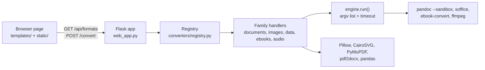

# File Converter

Drop a file, see every format it can become, download the result: one self-hosted web app for documents, images, data, ebooks and audio.

File Converter puts Pandoc, LibreOffice, Calibre, ffmpeg and a few Python libraries behind one small Flask API and a drag-and-drop page, so you don't have to remember which tool converts what. The Docker image installs all of them. It is for people who would rather not upload their files to an online converter, and it is built for running on your own machine or a trusted network. It covers 38 file extensions and 319 source → target pairs, and its PDF → Word path repairs several kinds of layout damage that raw pdf2docx output produces.


**No hosted demo.** The app needs a server with these engines installed. The [project page](https://www.adriangaona.dev/work/file-converter) has a guided walkthrough of the real interface.

## Contents

- [Features](#features)
- [Supported conversions](#supported-conversions)
- [Engineering highlights](#engineering-highlights)
- [Tech stack and design decisions](#tech-stack-and-design-decisions)
- [Getting started](#getting-started)
- [API](#api)
- [Configuration](#configuration)
- [Tests, lint and CI](#tests-lint-and-ci)
- [Security and limitations](#security-and-limitations)
- [License](#license)
- [Author](#author)

## Features

- **Drag and drop or browse.** The page offers only the targets the server has registered for that file's extension, grouped by family, and refuses a file over the upload cap before sending it.
- **38 extensions, 319 conversion pairs.** Both counts come from `converters.matrix()`, and aliases such as `jpg`/`jpeg` and `yml`/`yaml` are counted separately.
- **PDF → DOCX with layout repair.** Repeated letterheads and footers become real Word headers and footers, with page numbers turned into `PAGE`/`NUMPAGES` fields. Side-by-side rows become tab stops, ruled tables keep their drawn column widths, and merged list lines are split again. When LibreOffice is installed, documents of up to 50 pages are re-rendered to check that no page spills onto an extra one.
- **Clear errors instead of broken output.** PDF → DOCX rejects password-protected PDFs, and scanned PDFs with no text layer, before it starts. A missing engine or library is named in the error. Every `/convert` error is JSON, and an unexpected one returns a generic message while the details go to the server log.
- **Nothing left on disk.** The upload and the converted file are deleted as soon as the download finishes or the conversion fails.
- **Small JSON API** (`/api/formats`, `/convert`, `/health`) that works from `curl`. `/health` and the page footer show a build stamp.
- **Light and dark themes**, keyboard support (arrow keys move between format chips; Enter or Space opens the file picker), and a skip link.
- **Opt-in `DEMO_MODE`.** It adds a per-IP hourly limit, a daily budget, a smaller upload cap and blocked types.


## Supported conversions

| Family | Formats | Engine |
|---|---|---|
| Documents | md, markdown, rst, txt, html, htm, docx, odt, rtf, tex, latex, epub: any ↔ any; all → pdf | Pandoc; WeasyPrint as the PDF engine; LibreOffice for docx/odt/rtf → pdf when installed |
| PDF as a source | pdf → txt, md, html, docx; pdf → png, jpg, jpeg, webp, gif, bmp, tiff, tif (first page) | PyMuPDF; pdf2docx plus the layout fixup |
| Images | png, jpg, jpeg, webp, gif, bmp, tiff, tif: any ↔ any; svg → any raster; raster → pdf | Pillow, CairoSVG |
| Data | csv, tsv, json, xlsx, xls, yaml, yml → csv, tsv, json, xlsx, yaml, yml; csv, tsv, json, xlsx, xls → html, md tables | pandas, openpyxl, xlrd, PyYAML |
| Ebooks | epub, mobi, azw3, fb2: any ↔ any; mobi, azw3, fb2 → pdf | Calibre (`ebook-convert`) |
| Audio | mp3, wav, ogg, flac, m4a, aac: any ↔ any | ffmpeg |

`xls` and `svg` are source-only, and only the first worksheet of a workbook is read. CSV and TSV saved by Excel on Windows (Windows-1252) and JSON or YAML with a UTF-8 byte-order mark are accepted. Images, data and PDF extraction need no system binaries.

## Engineering highlights

1. **A registry is the single source of truth.** Each family module calls `register()` / `register_many()` at import time. The Flask layer never hard-codes a format: it asks `matrix()` what is possible and `get_converter()` for the handler, and the UI renders whatever `/api/formats` returns. Adding a format means writing one handler, `fn(in_path, out_path)`, and one registration line. See [`converters/registry.py`](converters/registry.py).
2. **External tools have one exit point, and uploads can't reach server files.** Every call to pandoc, soffice, ebook-convert and ffmpeg goes through `engine.run()`, which passes an argument list (never `shell=True`), enforces a timeout and turns a non-zero exit into a `ConversionError` that carries the tool's stderr. Pandoc always runs with `--sandbox` and WeasyPrint may only fetch `data:` URIs, so an ``, a LaTeX `\input` or an RST `include` in an upload can't pull a server file into the output; tests prove each case. Each LibreOffice call gets its own profile directory, deleted afterwards. See [`converters/engine.py`](converters/engine.py) and [`tests/test_documents.py`](tests/test_documents.py).
3. **Upload names never become paths.** The source extension must be a known format and the pair must be registered before anything is written. On disk the job is a random UUID. The user's filename survives only as the download name, with any path part dropped and characters Windows forbids replaced; accents and non-Latin scripts are kept. The file is streamed through the response so that closing it deletes it. See [`web_app.py`](web_app.py).
4. **The PDF → DOCX repair is geometry-driven.** PyMuPDF reads the source layout, and python-docx repairs what pdf2docx produced, in focused modules for analysis, header/footer bands, columns, tables and paragraphs. Each repair is best-effort: a failure falls back to the unrepaired output and is logged with its traceback. A verify-and-retry loop then re-renders the DOCX with LibreOffice at up to three spacing levels, the first one untouched, and stops as soon as the page counts match. Each layout that once broke is a generated PDF fixture with its own test. See [`converters/pdf_docx_fixup/`](converters/pdf_docx_fixup/), [`converters/documents.py`](converters/documents.py), [`tests/pdf_fixtures.py`](tests/pdf_fixtures.py) and [`tests/test_pdf_layout.py`](tests/test_pdf_layout.py).
5. **Tests skip rather than fail, and CI runs them all.** Heavy libraries are imported inside the handlers, so the package still imports when one is missing, and tests that need a missing binary skip with the reason. CI runs the suite without engines on every pull request and, on `main`, inside the Docker image, where nothing may skip. See [`tests/conftest.py`](tests/conftest.py) and [`.github/workflows/ci.yml`](.github/workflows/ci.yml).

## Tech stack and design decisions



- **Flask + gunicorn (2 sync workers, 300 s timeout).** The work is CPU- and subprocess-bound, so each conversion simply runs inside its request.
- **The best tool for each family.** Pandoc is the text hub, with WeasyPrint as its PDF engine so no TeX install is needed. LibreOffice handles Office → PDF for fidelity, and the image ships Calibri/Cambria-compatible fonts so its pages break the way Word's do.
- **An unprivileged container.** gunicorn runs as the `converter` user (uid 10001), which can write only to `DATA_DIR`, its home directory and the shared temp directories.
- **Pinned dependencies.** `requirements.web.txt` pins the direct Python dependencies and pulls in `constraints.txt`, which locks everything they install. Pandoc is the official 3.11 release, pinned by checksum.
- **Vanilla JS, no build step.** The page loads nothing from third parties. Docker is the main way to run it, because the engines are system binaries.

```text
web_app.py               Flask routes, upload handling, DEMO_MODE wiring
demo_guard.py            opt-in demo limits (stdlib + SQLite)
converters/
  __init__.py            imports each family module so it registers its pairs
  registry.py            FORMATS, register(), get_converter(), matrix()
  engine.py              subprocess helpers for pandoc, soffice, ffmpeg, ebook-convert
  documents.py           Pandoc text hub, → PDF, PDF → txt/md/html/docx
  pdf_docx_fixup/        PDF → DOCX layout repair, one module per repair
  images.py, data.py,    one module per remaining family
  ebooks.py, audio.py
templates/, static/      the page, its script and its styles
tests/                   pytest suite and generated PDF fixtures
docs/                    screenshots
app.py                   older desktop Markdown → DOCX tool (see Limitations)
SPEC.md                  design notes: handler contract, module boundaries, API
Dockerfile               image with every engine
requirements.web.txt     pinned runtime dependencies (+ constraints.txt)
requirements.dev.txt     adds pytest and ruff
pyproject.toml           ruff and pytest settings
.github/workflows/ci.yml lint, tests, and the full suite in Docker
```

## Getting started

### Docker (recommended: every engine included)

Requires Docker (tested with Docker Engine 29.5). The image is about 2.5 GB, since it bundles Pandoc, LibreOffice, Calibre and ffmpeg.

```bash
git clone https://github.com/jadrianlg16/file-converter.git
cd file-converter
docker build -t file-converter . && docker run --rm -p 127.0.0.1:5007:5007 file-converter
```

Open <http://localhost:5007>. The port is published on `127.0.0.1` only; see [Security](#security-and-limitations) before you expose it any wider. LibreOffice, Calibre and ffmpeg come from unpinned Debian packages.

### Local Python

Requires Python 3.12. To get the families that use them, put Pandoc 3.11, LibreOffice (`soffice`), Calibre (`ebook-convert`) and `ffmpeg` on your `PATH`. Every pandoc call uses `--sandbox`, which older builds such as Debian's 3.1.11 package can't combine with docx, odt or epub output. Without the engines, images, data and PDF extraction still work, and other pairs return a clear error. SVG input also needs the Cairo system library.

```bash
python3.12 -m venv .venv          # Windows: py -3.12 -m venv .venv
source .venv/bin/activate         # Windows PowerShell: .venv\Scripts\Activate.ps1
pip install -r requirements.web.txt
flask --app web_app run --port 5007
```

Uploads go to `./data` next to `web_app.py` unless `DATA_DIR` says otherwise. Both `flask run` and `python web_app.py` listen on `127.0.0.1`; set `HOST=0.0.0.0` to serve beyond the local machine on purpose.

## API

| Method and path | Request | Response |
|---|---|---|
| `GET /` | | The page |
| `GET /api/formats` | | `{"formats": {"<ext>": {"name", "category", "targets": [{"ext", "name", "category"}]}}, "maxUploadMb": N}`, plus `"demo"` when `DEMO_MODE=1` |
| `POST /convert` | multipart `file` + `target` (an extension) | The converted file as an attachment with status 200, or `{"error": "..."}` with 400 (bad input or unsupported pair), 403 (blocked by `DEMO_BLOCK`), 413 (file too large), 422 (conversion failed), 429 (demo limit), 500 (unexpected error) or 501 |
| `GET /health` | | `{"status": "ok", "formats": <number of source formats>, "build": "<stamp>"}` |

Any 2xx from `/convert` is the file, including `.json` outputs, which are served as `application/json`.

```bash
curl -F file=@notes.md -F target=pdf -o notes.pdf http://localhost:5007/convert
```

## Configuration

Every variable is optional.

| Variable | Default | Purpose |
|---|---|---|
| `DATA_DIR` | `./data` next to `web_app.py` (the image sets `/app/data`) | Working folder for in-flight uploads and outputs, and the demo counter database. |
| `MAX_UPLOAD_MB` | `200` | Upload cap in MB. Ignored when `DEMO_MODE=1`. |
| `PORT` | `5007` | Port for `python web_app.py` only; the image always runs gunicorn on 5007. |
| `HOST` | `127.0.0.1` | Interface for `python web_app.py` only; set `0.0.0.0` to expose it deliberately. The image's gunicorn always binds `0.0.0.0` inside the container. |
| `DEMO_MODE` | off | `1` turns on the demo limits below. |
| `DEMO_MAX_UPLOAD_MB` | `10` | Upload cap in MB while demo mode is on. |
| `DEMO_RATE_PER_HOUR` | `5` | Conversions per client IP per rolling hour. |
| `DEMO_DAILY_BUDGET` | `200` | Conversions per UTC day, all clients combined. |
| `DEMO_BLOCK` | empty | Comma-separated extensions refused as a source or a target, e.g. `wav,flac`. |
| `DEMO_REPO_URL` | `https://github.com/` | Link shown in limit messages and the demo banner. |
| `DEMO_PROXY_HOPS` | `0` | Reverse proxies in front of the app that append to `X-Forwarded-For`. `0` ignores the header (the socket peer is the client); set it to your proxy count so a client can't forge the header. |

Demo counters live in SQLite under `DATA_DIR`, so gunicorn workers share them and they survive restarts.

## Tests, lint and CI

```bash
pip install -r requirements.dev.txt
pytest -rs
ruff check . && ruff format --check .
```

The suite covers the registry wiring, the HTTP layer (status codes, JSON errors, download names, file cleanup), each converter family against small fixtures generated inside the tests, the pandoc sandbox, the PDF → DOCX layout repairs, and the demo guard. Tests that need `pandoc`, `soffice`, `ebook-convert` or `ffmpeg` skip when the binary is missing, and `-rs` prints each reason (for example `pandoc not installed`). To run all of them, use the image, which has every engine:

```bash
docker run --rm -v "$PWD/tests:/app/tests:ro" file-converter sh -c "pip install -q --user --no-warn-script-location pytest==9.1.1 && python -m pytest -q -rs -p no:cacheprovider tests"
```

[`ci.yml`](.github/workflows/ci.yml) runs the install, `ruff` and `pytest` commands above on every pull request and push to `main`. On pushes to `main`, and when started by hand, it also builds the image, runs the full suite inside it and fails if any test skipped.

To upgrade a dependency, change its pin in `requirements.web.txt`, install `requirements.dev.txt` into a fresh venv, run the suite, and regenerate `constraints.txt` from that venv's `pip freeze`, leaving out the packages pinned in the requirements files.

## Security and limitations

**This app is not hardened for untrusted uploads. Run it locally or on a trusted network, and don't expose it to the internet as-is.**

- **Run it offline.** Nothing needs the network at runtime, so run the container with `--network none`:

  ```bash
  docker run --rm --network none -p 127.0.0.1:5007:5007 file-converter
  ```

  This is the main containment for a malicious document. LibreOffice, for
  example, fetches an external image that a `.docx`/`.odt` references on load
  (an SSRF vector); `--network none` cuts all egress, and the full test suite
  passes with it.
- **What else is in place.** Pandoc runs sandboxed and WeasyPrint only loads `data:` URIs, so documents can't read server files through them. ffmpeg is pinned to the input's demuxer and allowed only the `file`/`pipe` protocols, so an audio upload can't act as a playlist that reads other files. LibreOffice runs with macros disabled and link-updating off. Image and SVG inputs are capped (about 40 megapixels) so a small file can't allocate gigabytes, and data conversions have a 64 MB output cap that stops YAML/JSON expansion bombs. The container runs as an unprivileged user; uploads are stored under random names and deleted after each request; error messages don't echo server paths or tool output. Responses carry `nosniff`, a `Content-Security-Policy` and `Referrer-Policy`.
- **What isn't.** LibreOffice, Calibre, ffmpeg, Pillow, PyMuPDF and pandas parse uploads inside the container with no per-conversion memory or CPU limit beyond the timeouts, and LibreOffice will still try to reach a referenced URL unless you run with `--network none`.
- **`DEMO_MODE` limits volume, not risk.** It caps rate, daily volume, upload size and file types, but it does not sandbox parsing. By default it trusts no `X-Forwarded-For` header (the socket peer is the client); set `DEMO_PROXY_HOPS` to the number of proxies in front of the app so the real client IP is used.
- **Chromium in Calibre.** Calibre renders ebook → PDF with Chromium. The image no longer turns Chromium's sandbox off, which was only needed while the container ran as root; this was tested with Docker Desktop. If ebook → PDF fails on your host with a Chromium sandbox error, run the container with `-e QTWEBENGINE_CHROMIUM_FLAGS="--no-sandbox --disable-gpu"`.
- **Scope.**
  - PDF → editable formats is best-effort with no OCR, and PDF → image renders the first page only.
  - There are no accounts and no job queue.
  - `app.py` is an older desktop Markdown → DOCX tool with its own `requirements.txt`, independent of the web app and not covered by the tests.

## License

Copyright © 2026 Adrián Gaona. All rights reserved. The source is public so it can be read and evaluated; no license is granted to reuse or redistribute it.

The tools this app calls keep their own licenses, among them Pandoc (GPL-2.0-or-later), LibreOffice (MPL-2.0), Calibre (GPL-3.0), ffmpeg (LGPL-2.1-or-later, or GPL depending on the build), PyMuPDF (AGPL-3.0 or an Artifex commercial license) and CairoSVG (LGPL-3.0-or-later). The other direct Python dependencies use MIT, BSD or similar permissive licenses.

## Author

**Adrián Gaona** · [adriangaona.dev](https://www.adriangaona.dev) · [LinkedIn](https://www.linkedin.com/in/jesus-lopez-95762b2b6) · [GitHub](https://github.com/jadrianlg16)
