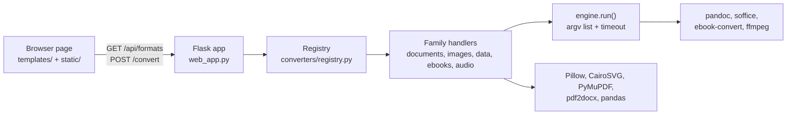

# File Converter

Drop a file, see every format it can become, download the result: one self-hosted web app for documents, images, data, ebooks and audio.

File Converter puts Pandoc, LibreOffice, Calibre, ffmpeg and a few Python libraries behind one small Flask API and a drag-and-drop page, so you don't have to remember which tool converts what. The Docker image installs all of them. It is for people who would rather not upload their files to an online converter, and it is built for running on your own machine or a trusted network. It covers 38 file extensions and 315 source → target pairs, and its PDF → Word path repairs several kinds of layout damage that raw pdf2docx output produces.


**No hosted demo.** The app needs a server with these engines installed. The [project page](https://www.adriangaona.dev/work/file-converter) has a guided walkthrough of the real interface.

## Contents

- [Features](#features)
- [Supported conversions](#supported-conversions)
- [Engineering highlights](#engineering-highlights)
- [Tech stack and design decisions](#tech-stack-and-design-decisions)
- [Getting started](#getting-started)
- [API](#api)
- [Configuration](#configuration)
- [Tests](#tests)
- [Security and known issues](#security-and-known-issues)
- [License](#license)
- [Author](#author)

## Features

- **Drag and drop or browse.** The page offers only the targets the server has registered for that file's extension, grouped by family.
- **38 extensions, 315 conversion pairs.** Both counts come from `converters.matrix()`, and aliases such as `jpg`/`jpeg` and `yml`/`yaml` are counted separately.
- **PDF → DOCX with layout repair.** Repeated letterheads and footers become real Word headers and footers, with page numbers turned into `PAGE`/`NUMPAGES` fields. Side-by-side rows become tab stops, ruled tables keep their drawn column widths, and merged list lines are split again. When LibreOffice is installed, documents of up to 50 pages are re-rendered to check that no page spills onto an extra one.
- **Clear errors instead of broken output.** PDF → DOCX rejects password-protected PDFs, and scanned PDFs with no text layer, before it starts. A missing engine is named in the error.
- **Small JSON API** (`/api/formats`, `/convert`, `/health`) that works from `curl`. `/health` and the page footer show a build stamp.
- **Light and dark themes**, keyboard support (arrow keys move between format chips; Enter or Space opens the file picker), and a skip link.
- **Opt-in `DEMO_MODE`.** It adds a per-IP hourly limit, a daily budget, a smaller upload cap and blocked types.


## Supported conversions

| Family | Formats | Engine |
|---|---|---|
| Documents | md, markdown, rst, txt, html, htm, docx, odt, rtf, tex, latex, epub: any ↔ any; all → pdf | Pandoc; WeasyPrint as the PDF engine; LibreOffice for docx/odt/rtf → pdf when installed |
| PDF as a source | pdf → txt, md, html, docx; pdf → png, jpg, jpeg, tiff (first page) | PyMuPDF; pdf2docx plus the layout fixup |
| Images | png, jpg, jpeg, webp, gif, bmp, tiff, tif: any ↔ any; svg → any raster; raster → pdf | Pillow, CairoSVG |
| Data | csv, tsv, json, xlsx, xls, yaml, yml → csv, tsv, json, xlsx, yaml, yml; csv, tsv, json, xlsx, xls → html, md tables | pandas, openpyxl, xlrd, PyYAML |
| Ebooks | epub, mobi, azw3, fb2: any ↔ any; mobi, azw3, fb2 → pdf | Calibre (`ebook-convert`) |
| Audio | mp3, wav, ogg, flac, m4a, aac: any ↔ any | ffmpeg |

`xls` and `svg` are source-only. Images, data and PDF extraction need no system binaries.

## Engineering highlights

1. **A registry is the single source of truth.** Each family module calls `register()` / `register_many()` at import time. The Flask layer never hard-codes a format: it asks `matrix()` what is possible and `get_converter()` for the handler, and the UI renders whatever `/api/formats` returns. Adding a format means writing one handler, `fn(in_path, out_path)`, and one registration line. See [`converters/registry.py`](converters/registry.py).
2. **External tools have one exit point.** Every call to pandoc, soffice, ebook-convert and ffmpeg goes through `engine.run()`. It passes an argument list (never `shell=True`), enforces a timeout (300 s, or 240 s for LibreOffice), and turns a non-zero exit into a `ConversionError` that carries the tool's stderr. Each LibreOffice call gets its own profile directory, so parallel gunicorn workers don't fight over the profile lock. See [`converters/engine.py`](converters/engine.py).
3. **Upload names never become paths.** The source extension must be a known format and the pair must be registered before anything is written. On disk the job is a random UUID, and the user's filename survives only as the download name, after `secure_filename`. See [`web_app.py`](web_app.py).
4. **The PDF → DOCX repair is geometry-driven.** PyMuPDF reads the source layout, and python-docx repairs what pdf2docx produced. A verify-and-retry loop then re-renders the DOCX with LibreOffice at up to three spacing levels, the first one untouched, and stops as soon as the page counts match. If none matches, it keeps the closest. Each layout that once broke is a generated PDF fixture with its own test. See [`converters/pdf_docx_fixup.py`](converters/pdf_docx_fixup.py), [`converters/documents.py`](converters/documents.py), [`tests/pdf_fixtures.py`](tests/pdf_fixtures.py) and [`tests/test_pdf_layout.py`](tests/test_pdf_layout.py).
5. **Tests skip rather than fail.** Heavy libraries are imported inside the handlers, so the package still imports when one is missing. Tests that need a missing binary or library skip and give the reason. See [`tests/conftest.py`](tests/conftest.py).

## Tech stack and design decisions



- **Flask + gunicorn (2 sync workers, 300 s timeout).** The work is CPU- and subprocess-bound, so each conversion simply runs inside its request.
- **The best tool for each family.** Pandoc is the text hub, with WeasyPrint as its PDF engine so no TeX install is needed. LibreOffice handles Office → PDF for fidelity, and the image ships Calibri/Cambria-compatible fonts so its pages break the way Word's do.
- **Vanilla JS, no build step.** The page loads nothing from third parties. Docker is the main way to run it, because the engines are system binaries.

```text
web_app.py               Flask routes, upload handling, DEMO_MODE wiring
demo_guard.py            opt-in demo limits (stdlib + SQLite)
converters/
  __init__.py            imports each family module so it registers its pairs
  registry.py            FORMATS, register(), get_converter(), matrix()
  engine.py              subprocess helpers for pandoc, soffice, ffmpeg, ebook-convert
  documents.py           Pandoc text hub, → PDF, PDF → txt/md/html/docx
  pdf_docx_fixup.py      PDF → DOCX layout repair
  images.py, data.py,    one module per remaining family
  ebooks.py, audio.py
templates/, static/      the page, its script and its styles
tests/                   pytest suite and generated PDF fixtures
docs/                    screenshots
Dockerfile               image with every engine
requirements.web.txt     runtime Python dependencies (requirements.dev.txt adds pytest)
```

## Getting started

### Docker (recommended: every engine included)

Requires Docker (tested with Docker Engine 29.5). The image is about 2.6 GB, since it bundles Pandoc, LibreOffice, Calibre and ffmpeg.

```bash
git clone https://github.com/jadrianlg16/file-converter.git
cd file-converter
docker build -t file-converter . && docker run --rm -p 127.0.0.1:5007:5007 file-converter
```

Open <http://localhost:5007>. The port is published on `127.0.0.1` only; see [Security](#security-and-known-issues) before you expose it any wider. The engines come from unpinned Debian packages.

### Local Python

Requires Python 3.12. To get the families that use them, put `pandoc`, LibreOffice (`soffice`), Calibre (`ebook-convert`) and `ffmpeg` on your `PATH`. Without them, images, data and PDF extraction still work, and other pairs return a clear error. SVG input also needs the Cairo system library.

```bash
python3.12 -m venv .venv                          # Windows: py -3.12 -m venv .venv
source .venv/bin/activate                         # Windows PowerShell: .venv\Scripts\Activate.ps1
pip install -r requirements.web.txt
DATA_DIR=./data flask --app web_app run --port 5007   # PowerShell: $env:DATA_DIR="data"; flask --app web_app run --port 5007
```

Set `DATA_DIR` to a writable folder, because the default, `/app/data`, is the container path. `flask run` listens on `127.0.0.1`. `python web_app.py` also works, but it binds to `0.0.0.0` (every interface).

## API

| Method and path | Request | Response |
|---|---|---|
| `GET /` | | The page |
| `GET /api/formats` | | `{"formats": {"<ext>": {"name", "category", "targets": [{"ext", "name", "category"}]}}}`, plus `"demo"` when `DEMO_MODE=1` |
| `POST /convert` | multipart `file` + `target` (an extension) | The converted file as an attachment, or `{"error": "..."}` with 400 (bad input or unsupported pair), 403 (blocked by `DEMO_BLOCK`), 422 (conversion failed), 429 (demo limit) or 500/501. An oversized upload gets 413. |
| `GET /health` | | `{"status": "ok", "formats": <number of source formats>, "build": "<stamp>"}` |

```bash
curl -F file=@notes.md -F target=pdf -o notes.pdf http://localhost:5007/convert
```

## Configuration

Every variable is optional.

| Variable | Default | Purpose |
|---|---|---|
| `DATA_DIR` | `/app/data` | Working folder for uploads, outputs and the demo counter database. Set it when running outside Docker. |
| `MAX_UPLOAD_MB` | `200` | Upload cap in MB. Ignored when `DEMO_MODE=1`. |
| `DEMO_MODE` | off | `1` turns on the demo limits below. |
| `DEMO_MAX_UPLOAD_MB` | `10` | Upload cap in MB while demo mode is on. |
| `DEMO_RATE_PER_HOUR` | `5` | Conversions per client IP per rolling hour. |
| `DEMO_DAILY_BUDGET` | `200` | Conversions per UTC day, all clients combined. |
| `DEMO_BLOCK` | empty | Comma-separated extensions refused as a source or a target, e.g. `wav,flac`. |
| `DEMO_REPO_URL` | `https://github.com/` | Link shown in limit messages and the demo banner. |

Demo counters live in SQLite under `DATA_DIR`, so gunicorn workers share them and they survive restarts.

## Tests

```bash
pip install -r requirements.dev.txt
pytest -rs
```

The suite covers the registry wiring, the `/health` and `/api/formats` endpoints, each converter family against small fixtures generated inside the tests, the PDF → DOCX layout repairs, and the demo guard. Tests that need `pandoc`, `soffice`, `ebook-convert` or `ffmpeg` skip when the binary is missing, and `-rs` prints each reason (for example `pandoc not installed`). To run all of them, use the image, which has every engine:

```bash
docker run --rm -v "$PWD/tests:/app/tests:ro" file-converter sh -c "pip install -q pytest && python -m pytest -q tests"
```

## Security and known issues

**This app is not hardened for untrusted uploads. Run it locally or on a trusted network, and don't expose it to the internet as-is.**

- **Trust boundary.** Pandoc runs without `--sandbox` and the container runs as root, so treat every upload as trusted input.
- **`DEMO_MODE` limits volume, not risk.** It caps rate, daily volume, upload size and file types, but it does not sandbox parsing. Its per-IP limit trusts `X-Forwarded-For`, so run it behind a proxy that sets that header.
- **Known bugs.** Converted outputs in `DATA_DIR` and LibreOffice's temp profiles are not cleaned up, so clear them now and then. The page reports a failed conversion when the target is `.json`, even though the server returned the file. An oversized upload gets Flask's HTML 413 page instead of JSON.
- **Scope.**
  - PDF → editable formats is best-effort with no OCR, and PDF → image renders the first page only.
  - There are no accounts and no job queue.
  - `app.py` is an older desktop UI, kept for reference and not maintained.

## License

Copyright © 2026 Adrián Gaona. All rights reserved. The source is public so it can be read and evaluated; no license is granted to reuse or redistribute it.

The tools this app calls keep their own licenses, among them Pandoc (GPL-2.0-or-later), LibreOffice (MPL-2.0), Calibre (GPL-3.0), ffmpeg (LGPL-2.1-or-later, or GPL depending on the build), PyMuPDF (AGPL-3.0 or an Artifex commercial license) and CairoSVG (LGPL-3.0-or-later). The other direct Python dependencies use MIT, BSD or similar permissive licenses.

## Author

**Adrián Gaona** · [adriangaona.dev](https://www.adriangaona.dev) · [LinkedIn](https://www.linkedin.com/in/jesus-lopez-95762b2b6) · [GitHub](https://github.com/jadrianlg16)
